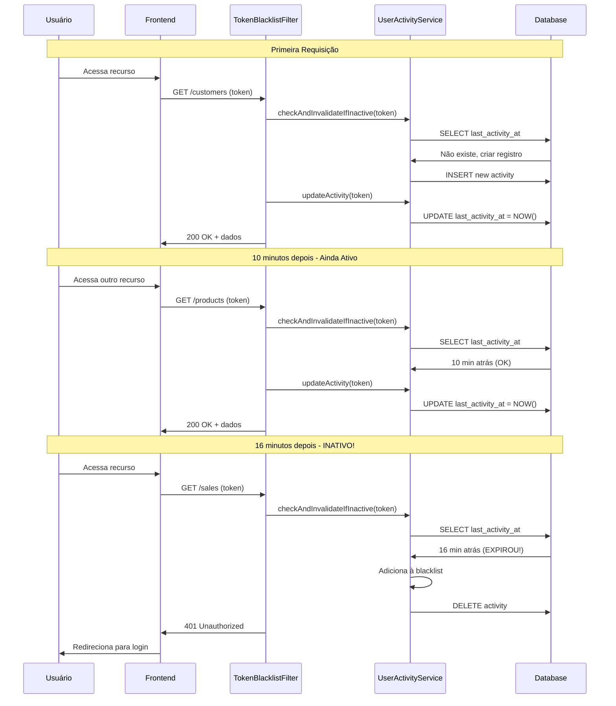

# Guia de Timeout por Inatividade - API de Vendas

Este documento descreve o sistema de invalidação automática de tokens JWT por inatividade.

## 📋 Visão Geral

O sistema invalida automaticamente tokens JWT quando o usuário fica **15 minutos sem fazer nenhuma requisição**. Isso aumenta a segurança do sistema, prevenindo que sessões abandonadas permaneçam ativas indefinidamente.

## ⏱️ Como Funciona

### 1. Rastreamento de Atividade

Cada requisição autenticada atualiza o timestamp de última atividade do usuário:

```
Requisição → TokenBlacklistFilter → Atualiza last_activity_at
```

### 2. Verificação de Inatividade

Antes de processar uma requisição, o sistema verifica:
- Tempo desde a última atividade
- Se passou 15 minutos ou mais → Token é invalidado automaticamente

### 3. Invalidação Automática

Quando detecta inatividade:
1. Token é adicionado à blacklist
2. Rastreamento de atividade é removido
3. Usuário recebe erro 401: "Sessão expirada por inatividade"
4. Cliente deve fazer login novamente

## 🔄 Fluxo Completo



## 🗄️ Estrutura do Banco de Dados

### Tabela: user_activity

| Coluna | Tipo | Descrição |
|--------|------|-----------|
| id | BIGSERIAL | ID primário |
| token_hash | VARCHAR(64) | Hash SHA-256 do token JWT (único) |
| user_id | BIGINT | ID do usuário |
| last_activity_at | TIMESTAMP | Timestamp da última requisição |
| created_at | TIMESTAMP | Primeira vez que o token foi usado |

**Índices:**
- `idx_token_hash_activity` - Busca rápida por hash do token
- `idx_last_activity` - Limpeza eficiente de atividades antigas

## ⚙️ Configuração

### application.properties

```properties
# Tempo de inatividade em minutos antes de invalidar o token
# Padrão: 15 minutos
jwt.inactivity.timeout.minutes=${JWT_INACTIVITY_TIMEOUT_MINUTES:15}
```

### Variável de Ambiente

```bash
# Alterar timeout para 30 minutos
export JWT_INACTIVITY_TIMEOUT_MINUTES=30

# Alterar timeout para 5 minutos (desenvolvimento/teste)
export JWT_INACTIVITY_TIMEOUT_MINUTES=5
```

## 📝 Mensagens de Erro

### Sessão Expirada por Inatividade

**Status:** 401 Unauthorized

**Response:**
```json
{
  "message": "Sessão expirada por inatividade. Faça login novamente."
}
```

**Ação do Cliente:**
- Remover token do armazenamento local
- Redirecionar para página de login
- Mostrar mensagem: "Sua sessão expirou por inatividade"

## 🎯 Cenários de Uso

### Cenário 1: Usuário Ativo

```
00:00 - Login (token gerado)
00:05 - GET /customers (atividade atualizada)
00:10 - POST /sales (atividade atualizada)
00:14 - GET /products (atividade atualizada)
00:20 - GET /reports (atividade atualizada)

Resultado: ✅ Todas as requisições funcionam normalmente
```

### Cenário 2: Usuário Inativo

```
00:00 - Login (token gerado)
00:05 - GET /customers (atividade atualizada)
[Usuário para de usar o sistema]
00:21 - GET /products (16 min depois)

Resultado: ❌ 401 - Sessão expirada por inatividade
```

### Cenário 3: Quase Inativo (14 minutos)

```
00:00 - Login
00:05 - GET /customers
00:14 - GET /products (14 min após login)
00:25 - GET /sales (11 min após última atividade)

Resultado: ✅ Todas funcionam (timer é resetado a cada requisição)
```

### Cenário 4: Logout Manual

```
00:00 - Login
00:05 - GET /customers
00:10 - POST /logout

Resultado: ✅ Token invalidado + atividade removida
```

## 🔒 Segurança

### Proteções Implementadas

1. **Sessões Abandonadas:** Previne que tokens de sessões esquecidas fiquem ativos
2. **Acesso Não Autorizado:** Se alguém roubar um token, ele expira após 15 min de inatividade
3. **Múltiplos Dispositivos:** Cada login gera um token único com seu próprio rastreamento
4. **Sem Overhead:** Hash do token em vez de armazenar token completo

### Diferenças: Expiração vs Inatividade

| Aspecto | Expiração do JWT | Timeout de Inatividade |
|---------|------------------|------------------------|
| **Tempo** | 24 horas (fixo) | 15 minutos sem uso |
| **Resetável** | ❌ Não | ✅ Sim (a cada requisição) |
| **Objetivo** | Limite máximo de vida | Detectar abandono |
| **Exemplo** | Token criado 00:00, expira 24:00 | Última atividade 14:00, expira 14:15 (se inativo) |

## 🧹 Limpeza Automática

### Job Agendado

Executa diariamente à meia-noite:

```java
@Scheduled(cron = "0 0 0 * * ?")
void cleanupExpiredTokens() {
    // Remove tokens expirados da blacklist
    tokenBlacklistService.cleanupExpiredTokens();

    // Remove atividades antigas (> 24 horas)
    userActivityService.cleanupOldActivities();
}
```

**O que é limpo:**
- Atividades de tokens que já expiraram (> 24 horas)
- Tokens da blacklist que já expiraram

## 💻 Implementação Frontend

### React/TypeScript Example

```typescript
import axios, { AxiosError } from 'axios';

// Configurar interceptor para lidar com timeout de inatividade
axios.interceptors.response.use(
  (response) => response,
  (error: AxiosError) => {
    if (error.response?.status === 401) {
      const message = error.response?.data?.message;

      if (message?.includes('inatividade')) {
        // Sessão expirou por inatividade
        localStorage.removeItem('access_token');

        // Mostrar notificação amigável
        toast.error('Sua sessão expirou por inatividade. Faça login novamente.');

        // Redirecionar para login
        window.location.href = '/login';
      }
    }

    return Promise.reject(error);
  }
);
```

### Vue.js Example

```javascript
// router/index.js
import { useAuthStore } from '@/stores/auth';

router.beforeEach(async (to, from, next) => {
  const authStore = useAuthStore();

  if (to.meta.requiresAuth && !authStore.isAuthenticated) {
    next('/login');
  } else {
    next();
  }
});

// API interceptor
api.interceptors.response.use(
  response => response,
  error => {
    if (error.response?.status === 401) {
      const authStore = useAuthStore();
      authStore.logout();

      if (error.response?.data?.message?.includes('inatividade')) {
        ElMessage.error('Sessão expirada por inatividade');
      }

      router.push('/login');
    }
    return Promise.reject(error);
  }
);
```

### Angular Example

```typescript
// auth.interceptor.ts
import { Injectable } from '@angular/core';
import { HttpInterceptor, HttpRequest, HttpHandler, HttpErrorResponse } from '@angular/common/http';
import { catchError } from 'rxjs/operators';
import { throwError } from 'rxjs';
import { Router } from '@angular/router';
import { AuthService } from './auth.service';

@Injectable()
export class AuthInterceptor implements HttpInterceptor {
  constructor(
    private router: Router,
    private authService: AuthService
  ) {}

  intercept(req: HttpRequest<any>, next: HttpHandler) {
    return next.handle(req).pipe(
      catchError((error: HttpErrorResponse) => {
        if (error.status === 401 && error.error?.message?.includes('inatividade')) {
          this.authService.logout();
          this.router.navigate(['/login']);
          alert('Sua sessão expirou por inatividade');
        }
        return throwError(() => error);
      })
    );
  }
}
```

## 🔧 Troubleshooting

### Problema: Sessão expira muito rápido

**Causa:** Timeout de 15 minutos pode ser curto para alguns casos de uso

**Solução:**
```bash
# Aumentar para 30 minutos
export JWT_INACTIVITY_TIMEOUT_MINUTES=30
```

### Problema: Usuário reclama de "logout automático"

**Causa:** Provável inatividade de 15+ minutos

**Solução:**
1. Verificar logs para confirmar:
```sql
SELECT * FROM token_blacklist
WHERE user_id = [ID]
ORDER BY blacklisted_at DESC
LIMIT 10;
```

2. Explicar ao usuário que é um recurso de segurança
3. Considerar aumentar timeout se necessário

### Problema: Performance degradada

**Causa:** Muitas consultas na tabela user_activity

**Solução:**
```sql
-- Verificar tamanho da tabela
SELECT COUNT(*) FROM user_activity;

-- Se muito grande, executar limpeza manual
DELETE FROM user_activity WHERE last_activity_at < NOW() - INTERVAL '24 hours';

-- Reindexar
REINDEX TABLE user_activity;

-- Atualizar estatísticas
ANALYZE user_activity;
```

### Problema: Mensagem de erro genérica

**Causa:** Erro ao processar timeout

**Solução:**
Verificar logs do servidor:
```bash
grep "UserActivityService" /var/log/sales-api.log
```

## 📊 Monitoramento

### Queries Úteis

```sql
-- Usuários atualmente ativos
SELECT
    ua.user_id,
    ua.last_activity_at,
    EXTRACT(EPOCH FROM (NOW() - ua.last_activity_at))/60 as minutes_inactive
FROM user_activity ua
WHERE ua.last_activity_at > NOW() - INTERVAL '15 minutes'
ORDER BY ua.last_activity_at DESC;

-- Atividades que estão prestes a expirar (10-15 min)
SELECT
    ua.user_id,
    ua.last_activity_at,
    EXTRACT(EPOCH FROM (NOW() - ua.last_activity_at))/60 as minutes_inactive
FROM user_activity ua
WHERE ua.last_activity_at BETWEEN NOW() - INTERVAL '15 minutes'
                              AND NOW() - INTERVAL '10 minutes'
ORDER BY ua.last_activity_at;

-- Tokens invalidados por inatividade hoje
SELECT COUNT(*)
FROM token_blacklist
WHERE blacklisted_at >= CURRENT_DATE;
```

## 🧪 Testes

### Teste Manual

```bash
# 1. Login
TOKEN=$(curl -X POST http://localhost:8080/api/v1/auth/login \
  -H "Content-Type: application/json" \
  -d '{"email":"user@example.com","password":"senha123"}' \
  | jq -r '.access_token')

# 2. Fazer requisição (funciona)
curl -X GET http://localhost:8080/api/customers \
  -H "Authorization: Bearer $TOKEN"

# 3. Aguardar 16 minutos (ou alterar timeout para 1 minuto em DEV)

# 4. Tentar requisição novamente (deve falhar)
curl -X GET http://localhost:8080/api/customers \
  -H "Authorization: Bearer $TOKEN"

# Resposta esperada:
# {"message":"Sessão expirada por inatividade. Faça login novamente."}
```

### Teste com Timeout Reduzido (DEV)

```bash
# Alterar para 1 minuto temporariamente
export JWT_INACTIVITY_TIMEOUT_MINUTES=1

# Reiniciar aplicação

# Fazer login e aguardar 61 segundos
# Próxima requisição deve falhar por inatividade
```

## 📈 Métricas Recomendadas

1. **Taxa de Expiração por Inatividade:**
   - Quantos tokens expiram por inatividade vs logout manual
   - Se muito alto, considerar aumentar timeout

2. **Tempo Médio de Sessão:**
   - Monitorar created_at vs blacklisted_at
   - Ajustar timeout baseado em padrões de uso real

3. **Requisições por Sessão:**
   - Quantas requisições antes de expirar
   - Indicador de engajamento do usuário

## 🔗 Arquivos Relacionados

- `UserActivityEntity.java` - Entidade JPA para rastreamento
- `UserActivityPanacheRepository.java` - Repositório de atividades
- `UserActivityService.java` - Lógica de timeout e rastreamento
- `TokenBlacklistFilter.java` - Verificação em cada requisição
- `LogoutUseCase.java` - Remove atividade no logout
- `TokenBlacklistCleanupJob.java` - Limpeza automática
- `V007__create_user_activity_table.sql` - Migration da tabela

---

**Última atualização:** 2026-01-24
**Versão da API:** 1.0.0
